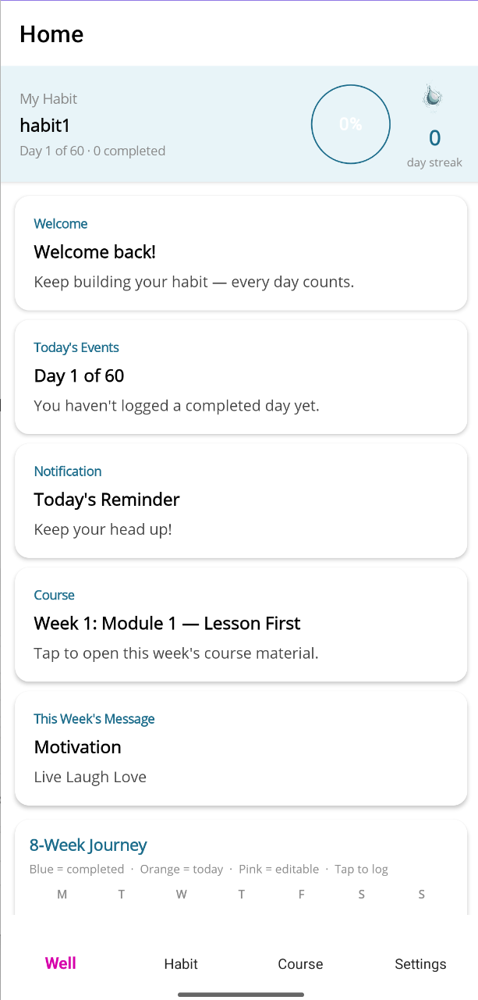
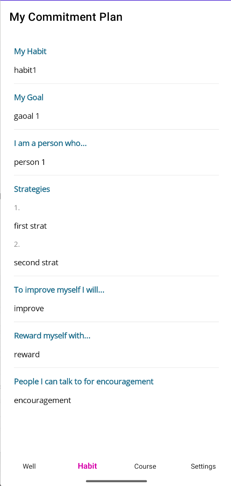
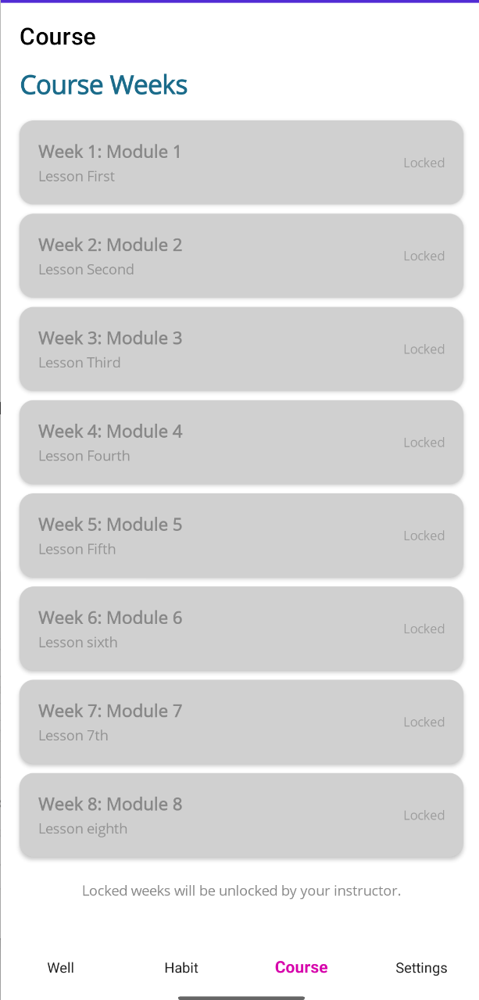
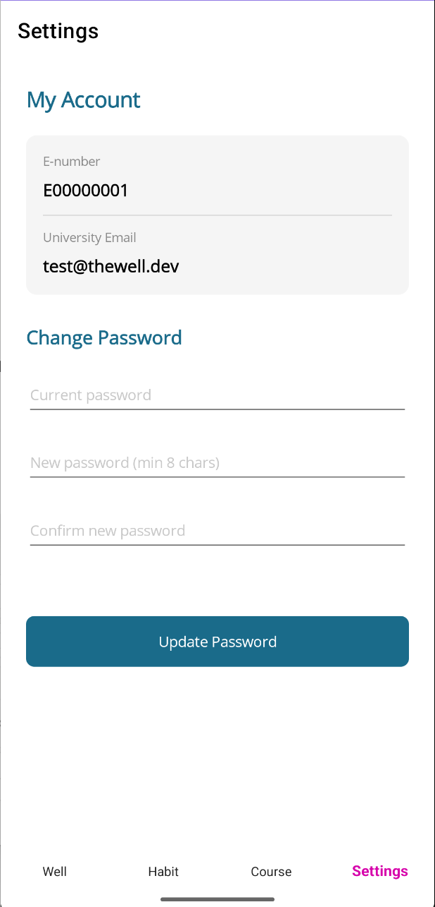
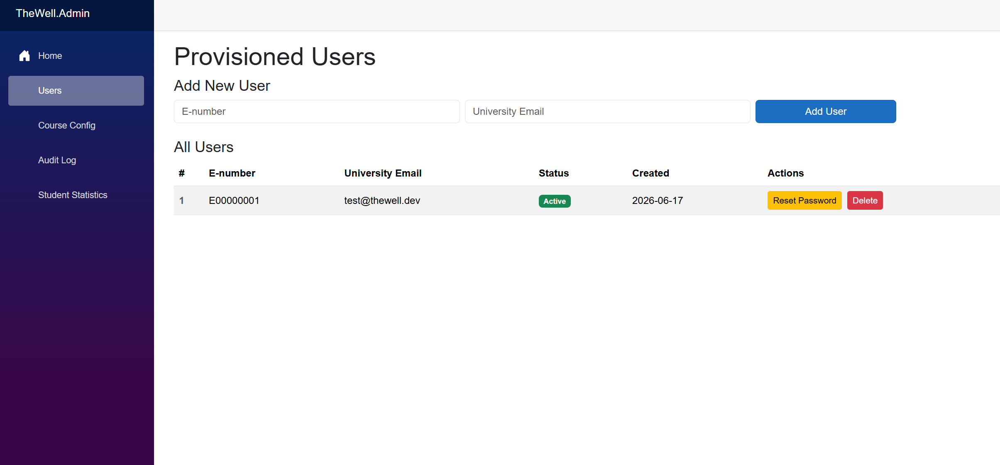
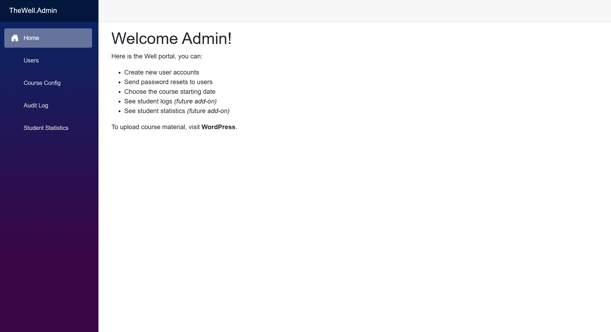
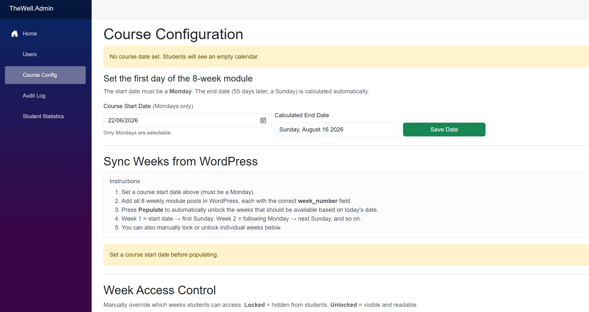

<p align="center">
  
</p>

<h1 align="center">The Well</h1>

<p align="center">
  A 60-day habit-tracking app built for a university wellness course.
</p>

<p align="center">
  
  
  
  
  
</p>

---

## Screenshots

### Mobile App

<p align="center">
  
  &nbsp;&nbsp;
  
  &nbsp;&nbsp;
  
  &nbsp;&nbsp;
  
</p>

### Admin Portal

<p align="center">
  
</p>
<p align="center">
  
</p>
<p align="center">
  
</p>

---

## About

**The Well** is a cross-platform mobile app developed for a university occupational therapy course. Students log in, fill out a one-time commitment plan, then track a single daily habit over 8 weeks. Progress is visualised as a well slowly filling with water.

A Blazor admin portal lets instructors provision student accounts, set course dates, and control which weekly content modules are visible. All course content — weekly modules, motivational messages — is authored in WordPress and pulled into the app via the REST API.

---

## Features

- **Secure authentication** — JWT access tokens + rotating refresh tokens + BCrypt password hashing
- **Forgot password** — email OTP flow with time-limited reset tokens
- **Commitment plan** — 8-field intake form, submitted once and locked on completion
- **Daily habit log** — entries editable within a 5-day window; colour-coded 8-week calendar
- **Course content** — week-by-week modules from WordPress, unlocked by admin on a schedule
- **Stats** — total completed days, current streak, well-fill percentage
- **Graduation screen** — shown automatically when the course period ends
- **Admin portal** — provision users, send welcome emails, set course dates, lock/unlock weeks

---

## Tech Stack

| Layer | Technology |
|---|---|
| Mobile App | .NET MAUI (Android / iOS / Windows) |
| API | ASP.NET Core Web API (.NET 10) |
| Admin Portal | Blazor Server (.NET 10) |
| Database | PostgreSQL via [Neon](https://neon.tech) |
| ORM | EF Core 10 + Npgsql |
| CMS | WordPress + ACF (custom post type) |
| Email | SendGrid (dynamic templates) |
| Auth | JWT Bearer + AES-256 + HMAC-SHA256 + BCrypt |

---

## Project Structure

```
TheWell.slnx
├── TheWell.Core        — DTOs, entities, interfaces
├── TheWell.Data        — EF Core DbContext, repositories
├── TheWell.API         — ASP.NET Core Web API  (port 5139)
├── TheWell.Admin       — Blazor Server admin portal
├── TheWell.MAUI        — .NET MAUI mobile app
└── TheWell.Tests       — Test project
```

---

## Getting Started

### Prerequisites

- [.NET 10 SDK](https://dotnet.microsoft.com/download)
- Visual Studio 2022 v17.12+ with the **.NET MAUI** and **ASP.NET and web development** workloads
- A [Neon](https://neon.tech) PostgreSQL database (free tier works)
- A [SendGrid](https://sendgrid.com) account with a dynamic template
- A WordPress site with the `weekly_content` custom post type and ACF fields

### 1. Clone the repo

```bash
git clone https://github.com/<your-username>/TheWell1.git
cd TheWell1
```

### 2. Configure secrets

```bash
cp TheWell.API/appsettings.Development.json.example   TheWell.API/appsettings.Development.json
cp TheWell.Admin/appsettings.Development.json.example TheWell.Admin/appsettings.Development.json
```

Fill in your values in both files:

| Key | Description |
|---|---|
| `ConnectionStrings:DefaultConnections` | Neon PostgreSQL connection string |
| `Jwt:Secret` | Min 32-character random string |
| `Jwt:Issuer` | `thewell-api` |
| `Jwt:Audience` | `thewell-maui` |
| `SendGrid:ApiKey` | Your SendGrid API key (`SG.…`) |
| `SendGrid:FromEmail` | Verified sender address |
| `SendGrid:WelcomeTemplateId` | Dynamic template ID |
| `Encryption:Key2` | Base64-encoded 32-byte AES key |
| `WordPress:BaseUrl` | Your WordPress site URL |
| `Admin:ApiKey` | Secret key for admin-only API endpoints |
| `Admin:ApiBaseUrl` | URL of the running API (default: `http://localhost:5139`) |

### 3. Run the API

```bash
cd TheWell.API
dotnet run --launch-profile http
```

The API starts on `http://localhost:5139` and creates all database tables automatically on first run.

### 4. Run the Admin portal

Open a second terminal:

```bash
cd TheWell.Admin
dotnet run
```

Open the URL printed in the terminal in your browser.

### 5. Run the mobile app

Open `TheWell.slnx` in Visual Studio, set **TheWell.MAUI** as the startup project, and run targeting **Windows Machine** or an Android emulator.

> **Android emulator:** the API is automatically reached at `http://10.0.2.2:5139/` — no manual config needed.
>
> **Windows Firewall:** if the Android emulator can't reach the API, run this once in an admin PowerShell:
> ```powershell
> New-NetFirewallRule -DisplayName "TheWell API Dev" -Direction Inbound -Protocol TCP -LocalPort 5139 -Action Allow
> ```

---

## User Flow

```
Login
  ├── Force Password Reset  (first login or after OTP reset)
  ├── Graduation Page       (course has ended)
  └── Intake Form           (one-time commitment plan, 8 questions)
        └── Dashboard  ── W tab  (habit panel + feed + 8-week calendar)
              ├── H tab  Habit         (read-only commitment plan)
              ├── C tab  Course        (WordPress weekly modules)
              └── S tab  Settings      (profile, change password)
                    └── Log Entry      (tap a calendar day to log it)
```

---

## Admin Portal

| Page | What it does |
|---|---|
| `/users` | Provision student accounts (sends welcome email with temp password), reset passwords, delete accounts |
| `/course-config` | Set course start date (Mondays only); auto-unlock weeks based on today's date; manually lock/unlock individual weeks |
| `/audit` | Coming soon |
| `/student-stats` | Coming soon |

---

## Calendar Rules

- Course runs for **56 days** (8 weeks) starting from the configured Monday
- Days are colour-coded: **Orange** = today, **Teal** = completed, **Pink** = editable (within 5 days), **Grey** = future/locked
- A log entry is only saved to the database when `IsCompleted = true`
- Users can edit a log entry up to **5 days** after the actual date

---

## Security

- E-number and email stored **AES-256 encrypted**; lookups use a deterministic **HMAC-SHA256** hash
- Passwords hashed with **BCrypt**
- OTP brute-force protection: 5 failed attempts locks the account out
- Per-IP rate limiting on login, OTP request, OTP verify, and password reset endpoints
- Admin endpoints require a secret `X-Admin-Key` header
- Global exception middleware prevents stack traces from leaking in API responses

---

## WordPress CMS

Create a custom post type `weekly_content` and add these ACF fields with **Show in REST API** enabled:

| Field | Type |
|---|---|
| `week_number` | Number |
| `module_number` | Number |
| `module_title` | Text |
| `motivational_message` | Textarea |
| `course_material` | Wysiwyg (HTML) |
| `notifications` | Text |
| `day_1` … `day_7` | Number |

---

## License

Developed for academic research at the university. All rights reserved.
